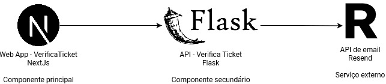

Sistema de verificação de ingressos de eventos.

Projeto desenvolvido para a sprint de Desenvolvimento Back-end Avançado da PUC Rio.


## Executando o projeto

```bash
npm run dev
## or
docker compose up
```

Abra [http://localhost:3000](http://localhost:3000) no navegador.

## Arquitetura


